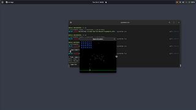
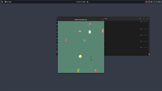

# Java Arcade Sprite Based Framework

Desafio: evoluir o Arcade Sprite Based Framework e implementar
o novo jogo __Woody Freeze Monster__ deixando o __Space Invaders__
funcionando.

#  Spaces Invaders

- [x]  evoluir o framework (mantendo o SpaceInvaders funcionando)

## Freeze Monster

Segue abaixo as regras de como deve funcionar o jogo FreezeMonster:

- [x]  Woody pode ir em qualquer direção (setas do teclado)

- [x] Woody dispara raio congelante com “espaço”

- [x] Raio congelante vai em linha reta na direção que o Woody estava deslocando

- [x] Raio congelante some quando sai do quadro, quando acerta monstro, quando acerta gosma ou quando bate em parede

- [x] Monstros se movem aleatoriamente em qualquer direção

- [x] Monstros soltam gosmas que escolhem uma direção e vão em linha reta

- [x] Gosmas desaparecem quando batem em uma parede, quando um raio as acertas ou quando saem do quadro.

- [x] Jogo acaba quando  Woody congela todos os monstros ou quando a gosma atinge o Woody.

### Referências

http://zetcode.com/tutorials/javagamestutorial/spaceinvaders/

Available under 2-Clause BSD License https://opensource.org/licenses/BSD-2-Clause  
